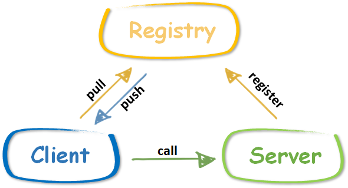

# rpcx常用的一些设置备忘 


- 一个应用中，一个服务只需要一个共享的`XClient`。它可以被通过**goroutine共享**，并且是**协程安全**的。
- `Go`代表异步调用，`Call`代表同步调用。
- `XClient`对于一个服务节点使用单一的连接，并且它会缓存这个连接直到失效或异常。 

### 服务发现

**rpcx**支持许多服务发现机制，你也可以实现自己的服务发现。

- Peer to Peer: 客户端直连每个服务节点。 the client connects the single service directly. It acts like the client type.
- Peer to Multiple: 客户端可以连接多个服务。服务可以被编程式配置。
- Zookeeper: 通过 zookeeper 寻找服务。
- Etcd: 通过 etcd 寻找服务。
- Consul: 通过 consul 寻找服务。
- mDNS: 通过 mDNS 寻找服务（支持本地服务发现）。
- In process: 在同一进程寻找服务。客户端通过进程调用服务，不走TCP或UDP，方便调试使用。

### 服务治理 (失败模式与负载均衡)
在一个大规模的**rpc系统**中，有许多服务节点提供同一个服务。客户端如何选择最合适的节点来调用呢？如果调用失败，客户端应该选择另一个节点或者立即返回错误？这里就有了故障模式和负载均衡的问题。

**rpcx 支持 故障模式**：

- Failfast：如果调用失败，立即返回错误
- Failover：选择其他节点，直到达到最大重试次数
- Failtry：选择相同节点并重试，直到达到最大重试次数
- 对于负载均衡，rpcx 提供了许多选择器：
- 
- Random： 随机选择节点
- Roundrobin： 使用 roundrobin 算法选择节点
- Consistent hashing: 如果服务路径、方法和参数一致，就选择同一个节点。使用了非常快的jump consistent hash算法。
- Weighted: 根据元数据里配置好的权重(weight=xxx)来选择节点。类似于nginx里的实现(smooth weighted algorithm)
- Network quality: 根据ping的结果来选择节点。网络质量越好，该节点被选择的几率越大。
- Geography: 如果有多个数据中心，客户端趋向于连接同一个数据机房的节点。
- Customized Selector: 如果以上的选择器都不适合你，你可以自己定制选择器。例如一个rpcx用户写过它自己的选择器，他有2个数据中心，但是这些数据中心彼此有限制，不能使用 Network quality 来检测连接质量。

### 注册服务
通常我们将方法注册为服务的方法，这些方法必须满足以下的要求：

- 必须是可导出类型的方法
- 接受3个参数，第一个是`context.Context`类型，其他2个都是可导出（或内置）的类型。
- 第3个参数是一个指针
- 有一个`error`类型的返回值

```go
func (t *Arith) Add(ctx context.Context, args *Args, reply *Reply) error {
	reply.C = args.A + args.B
	fmt.Printf("call: %d + %d = %d\n", args.A, args.B, reply.C)
	return nil
}

func (t *Arith) Say(ctx context.Context, args *string, reply *string) error {
	*reply = "hello " + *args
	return nil
}
```

**Rpcx 也支持将纯函数注册为服务，函数必须满足以下的要求**：

- 函数可以是可导出的或者不可导出的
- 接受3个参数，第一个是`context.Context`类型，其他2个都是可导出（或内置）的类型。
- 第3个参数是一个指针
- 有一个`error`类型的返回值

```go
func mul(ctx context.Context, args *Args, reply *Reply) error {
	reply.C = args.A * args.B
	return nil
}

// .....
func main() {
	flag.Parse()

	s := server.NewServer()
	addRegistryPlugin(s)

	s.RegisterFunction("a.fake.service", mul, "")
	go s.Serve("tcp", *addr)

	time.Sleep(time.Minute)

	err := s.UnregisterAll()
	if err != nil {
		panic(err)
	}
}
```

### 注册中心



rpcx会自动将服务的信息比如服务名，监听地址，监听协议，权重等注册到注册中心，同时还会定时的将服务的吞吐率更新到注册中心。

如果服务意外中断或者宕机，注册中心能够监测到这个事件，它会通知客户端这个服务目前不可用，在服务调用的时候不要再选择这个服务器。

客户端初始化的时候会从注册中心得到服务器的列表，然后根据不同的路由选择选择合适的服务器进行服务调用。 同时注册中心还会通知客户端某个服务暂时不可用。

通常客户端会选择一个服务器进行调用。

下面看看不同的注册中心的使用情况。


# 参考

- [doc.rpcx.io](https://doc.rpcx.io/part1/client.html)
